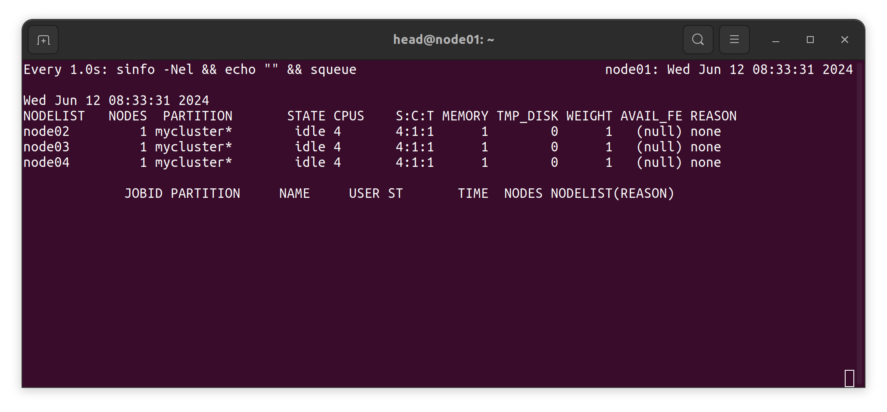
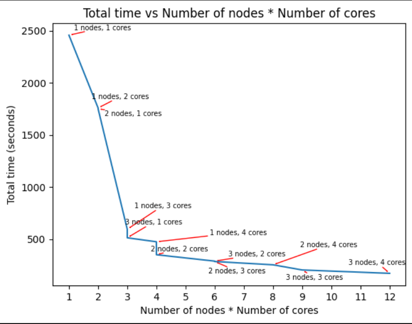
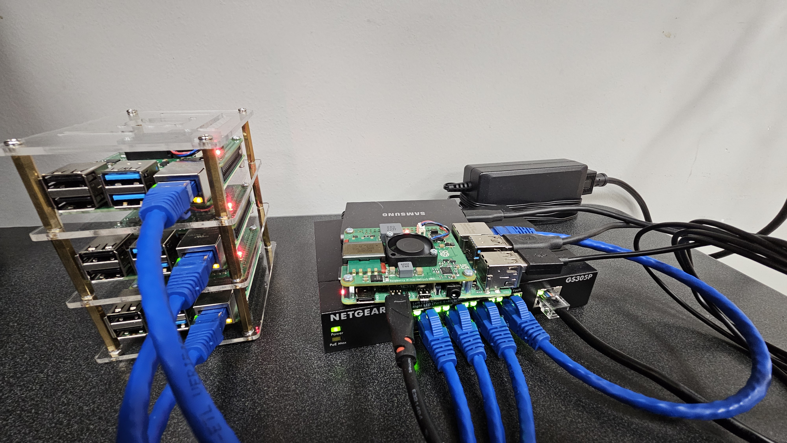

# Building A Local Cluster Using Raspberry Pis

by Avery Fernandez, University of Alabama Libraries

*All scripts are MIT License, see repository for a copy of the license.*

August 2024



In these setup instructions, we build a local cluster using Raspberry Pis. This will allow us to run parallel computing jobs across Raspberry Pis.

Our approach takes inspiration from Garrett Mills' tutorial on [Building a Raspberry Pi Cluster](https://glmdev.medium.com/building-a-raspberry-pi-cluster-784f0df9afbd). We recommend checking out his tutorial for additional explanations and setup instructions. 

We wanted the ability to automate some of the setup on the Raspberry Pis, so we created bash scripts (see below) that help with configuration and software installation. If you prefer a more manual approach to the setup, you should be able to apply each step within the scripts line by line. See the script comments to identify what each step should accomplish. **Note that we expect some minor changes will be needed depending on the Raspberry Pi and software versions used. Let us know if you run into any issues.**

> [!CAUTION]
> This was created for a local academic research experiment; it is not meant to be a production level cluster where you would need to consider additional factors such as access, security, network speed, backup, and software maintenance.

## Table of Contents

0. [Prerequisites](#prerequisites)
1. [The Hardware](#the-hardware)
2. [The Operating System](#the-operating-system)
    * [Flashing the microSD Cards](#flashing-the-microsd-cards)
3. [Basic Setup and Configuration for all Raspberry Pis](#basic-setup-and-configuration-for-all-raspberry-pis)
    * [Hostname Configuration](#hostname-configuration)
4. [Head Node Setup](#head-node-setup)
5. [Compute Node Setup](#compute-node-setup)
6. [Basic Slurm Commands](#basic-slurm-commands)
7. [Run Python Script with Conda](#run-python-script-with-conda)
8. [Test all Compute Nodes and CPUs](#test-all-compute-nodes-and-cpus)
9. [Conclusion](#conclusion)
10. [Possible Issues](#possible-issues)

## Prerequisites

Before you start, make sure you have the following:

* A basic understanding of Linux commands and terminal usage.
* An active internet connection for downloading software and updates.
* Materials listed in the following hardware section.

## The Hardware

To build a local cluster, you will need the following hardware:

* 1 x Raspberry Pi 4 Model B or newer (for the head node)
* 2 or more x Raspberry Pi 4 Model B or newer (for the compute nodes)
    * We used 3 compute nodes in this tutorial, but you can use as many as you like.
* 1 x PoE+ Raspberry Pi Hats for each Raspberry Pi
    * This allows power over the ethernet connections
* 1 x PoE+ unmanaged network switch
    * You will need a PoE+ network switch that has enough ports to connect all of your Raspberry Pis and connect to your network.
* 1 x microSD card for each Raspberry Pi
    * This does not need to be a large card, as it will only be used to boot the Raspberry Pi. The rest of the storage will be on the shared network drive.
* 1 x ethernet cable for each Raspberry Pi
    * You will need an ethernet cable to connect each Raspberry Pi to the PoE+ network switch. Ensure you have ethernet cables that support power over ethernet.
* 1 x shared network drive (atleast 64 GB)
    * This will be used to store the data and programs that you want to run on the cluster.
    * We used a 2.5 inch SSD with USB3
* 1 x keyboard and monitor
    * A keyboard and monitor to set up the head node and compute nodes.

This setup allows us to have a head node that controls the cluster and compute nodes that do the actual computing. The head node will be connected to the shared network drive and the compute nodes will be connected to the head node via the PoE+ network switch. That means that we can easily add more compute nodes to the cluster by simply connecting them to the PoE+ network switch.

## The Operating System

For this tutorial, we will be using the Raspberry Pi OS Lite operating system. This is a lightweight version of the Raspberry Pi OS that does not include a desktop environment. This is ideal for a headless setup, as we will be accessing the Raspberry Pis remotely.

You can download the Raspberry Pi OS Lite from the [Raspberry Pi website](https://www.raspberrypi.com/software/operating-systems/). The file you download will most likely be a `.img.xz` file, which is a compressed disk image file. You don't need to extract this file, as we will be writing it directly to the microSD cards.

In order to install the Raspberry Pi OS Lite on the microSD cards, you will need to use the [Raspberry Pi Imager](https://www.raspberrypi.com/software/) or a tool like [balenaEtcher](https://etcher.balena.io/).

### Flashing the microSD Cards

To flash the microSD cards with the Raspberry Pi OS Lite, follow these steps:

1. Insert the microSD card into your computer.
2. Open balenaEtcher and click on `Flash from file`.
3. Select the `.img.xz` file that you downloaded from the Raspberry Pi website.
4. Click on `Select target` and choose the microSD card that you inserted into your computer.
5. Click on `Flash!` and wait for the process to complete.

Once the flashing process is complete, you can remove the microSD card from your computer and insert it into the Raspberry Pi. Do this for each Raspberry Pi that you have.

## Basic Setup and Configuration for all Raspberry Pis

Now we will go through the basic setup and configuration for all of the Raspberry Pis in the cluster. This includes setting up the hostname, enabling SSH, and setting up default settings. This allows us to easily access the Raspberry Pis remotely on our local network, so that we can run our setup scripts later on.

Do the following steps for each Raspberry Pi:

1. Insert the MicroSD card into the Raspberry Pi
2. Connect the Raspberry Pi to a monitor and keyboard
3. Connect the Raspberry Pi to the PoE+ network switch using a compatible Ethernet cable
    * This will provide the Raspberry Pi with internet access and power
4. Follow the on-screen instructions to set up the Raspberry Pi
    * Set Language to US English
    * Set US Keyboard
    * Username: head
        * for the workers use e.g. `worker1`
    * Password: {Long and secure password}
5. Once the setup is complete, you should see the command prompt/terminal
6. Enter the raspi-config tool by running the following command:

    ```bash
    sudo raspi-config
    ```
7. Enable Auto-Login
    * Navigate to `1 System Options` -> `S5 Boot / Auto Login` -> `B2 Console Autologin`
8. Enable SSH
    * Navigate to `3 Interface Options` -> `I1 SSH` -> `Yes`
9. Change the locale
    * Navigate to `5 Localisation Options` -> `L1 Locale` -> `en_US.UTF-8 UTF-8` -> `en_US.UTF-8` -> `OK`
10. Change the timezone
    * Navigate to `5 Localisation Options` -> `L2 Timezone` -> `US` -> `Eastern` -> `OK`
11. Exit the raspi-config tool and reboot the Raspberry Pi
    * It will ask you to reboot, select `Yes`. If it doesn't, run the `sudo reboot` command

Once you have completed these steps for all of the Raspberry Pis, you should be able to access them remotely using SSH. But before we do that, we need to make sure that we have all of the IP addresses for the Raspberry Pis.

We recommend getting the IP addresses of the Raspberry Pis by running `hostname -I` on each Raspberry Pi. This will give you the IP address that you can use to connect to the Raspberry Pi remotely. Write down the IP addresses for each Raspberry Pi, as you will need them later on. Write down the gateway as well. We can find out what the gateway is by using `ip route`.

`Head Node`(`node01`): 10.x.y.1
`Worker 1`(`node02`): 10.x.y.2
`Worker 2`(`node03`): 10.x.y.3
`Worker 3`(`node04`): 10.x.y.4
`Gateway`: 10.x.y.0/24, 10.x.z.0/24

We have multiple gateways because our nodes are on two different subnets. This is will not be the case for most users.

We can now access the Raspberry Pis remotely using SSH. Open a terminal or putty and connect to the Raspberry Pi using the IP address:

`head@10.x.y.1`

For terminal:

```bash
ssh head@10.x.y.1
```

The first time you connect to a Raspberry Pi, you will be asked to accept the fingerprint. Type `yes` and press `Enter` to continue. You will then be prompted for the password that you set up during the initial setup.

Once you have successfully connected to the Raspberry Pi, you should see the command a prompt/terminal. You can now run commands on the Raspberry Pi remotely.

## Hostname Configuration

Now that we have all of the Raspberry Pis setup and we can access them remotely, we need to configure the hostnames. This will allow us to easily identify each Raspberry Pi in the cluster.

First, we will create a script on our local machine that will configure the hostnames for each Raspberry Pi. This script will be copied to each Raspberry Pi and run remotely.

Create a new file called `set_hostname.sh` on your local machine and add the following content:

```bash
#!/bin/bash
# Ask user for the hostname
echo "Enter the hostname: "
echo "Example: node01"
read HOSTNAME

# Set the hostname
sudo hostname $HOSTNAME

# Set the hostname file
sudo echo $HOSTNAME > /etc/hostname

# Set the hosts file to
sudo echo "127.0.0.1       localhost" > /etc/hosts
sudo echo "::1             localhost ip6-localhost ip6-loopback" >> /etc/hosts
sudo echo "ff02::1         ip6-allnodes" >> /etc/hosts
sudo echo "ff02::2         ip6-allrouters" >> /etc/hosts
sudo echo "" >> /etc/hosts
sudo echo "127.0.1.1               $HOSTNAME" >> /etc/hosts
```

This script will prompt you to enter the hostname for the Raspberry Pi and then set the hostname and update the `/etc/hostname` and `/etc/hosts` files.

Now we need to copy this script to each Raspberry Pi and run it remotely. We can do this using the `scp` command. Run the following command to copy the script to the head node:

```bash
scp set_hostname.sh head@10.x.y.1:/~
```

This will copy the `set_hostname.sh` script to the home directory of the head node.

Now we need to connect to the head node and run the script. Run the following command to connect to the head node:

```bash
ssh head@10.x.y.1
```

Once you are connected to the head node, run the following command to run the script:

```bash
sudo bash set_hostname.sh
```

This will prompt you to enter the hostname for the head node. Enter `node01` and press `Enter` to continue. The script will then set the hostname and update the `/etc/hostname` and `/etc/hosts` files.

Now we need to repeat this process for each of the compute nodes. With each compute node, you will need to enter a different hostname. For example, you can use `node02`, `node03`, and `node04` for the compute nodes.

Once you have set the hostname for each Raspberry Pi, you can verify that it has been set correctly by running the `hostname` command. You should see the hostname that you entered.

## Head Node Setup

Now that we have all of the Raspberry Pis setup and we can access them remotely, we need to configure the head node. This will be the main node that controls the cluster and runs the jobs. 

We need to set up a few additional things on this head node. This includes setting up a shared network drive, installing the necessary software, configuring chrony for time synchronization, and setting up slurm for job scheduling.

Before we can start, you will need to do the following steps for the head node:
1. Write down Gateway IPs (as mentioned above)
    * Example: `10.x.y.0/24`
2. Plug in the external SSD to the head node via USB
3. identify what directory the external SSD is mounted to
    * Run `lsblk` and look for the external SSD
    * Example: `/dev/sda1`

Now we can start setting up the head node. We will also be using a script to set up the head node. Create a new file called `install.sh` on your local machine and add the following content:

```bash
#!/bin/bash
# Update the system
sudo apt update && sudo apt upgrade -y

# Install Chrony
sudo apt install chrony -y

# Ask user for multiple gateway IPs and cat them to the chrony configuration

echo "Enter the gateway IPs separated by a space: "
echo "Example: 10.x.y.0/24 10.x.z.0/24"
read GATEWAY_IPS
# Format is: `allow {IP}`
for IP in $GATEWAY_IPS; do
    echo "allow $IP" | sudo tee -a /etc/chrony/chrony.conf
done

# Configure time syncing
# Add local stratum 10
echo "local stratum 10" | sudo tee -a /etc/chrony/chrony.conf

# Add some external NTP servers

echo "server 0.ubuntu.pool.ntp.org iburst" | sudo tee -a /etc/chrony/chrony.conf
echo "server 1.ubuntu.pool.ntp.org iburst" | sudo tee -a /etc/chrony/chrony.conf
echo "server 2.ubuntu.pool.ntp.org iburst" | sudo tee -a /etc/chrony/chrony.conf
echo "server 3.ubuntu.pool.ntp.org iburst" | sudo tee -a /etc/chrony/chrony.conf

# Restart chrony
sudo systemctl restart chrony
sudo systemctl enable chrony

# Setup main drive

# Grab external SSD directory
echo "Enter the external SSD directory: "
echo "Example: /dev/sda1"
read SSD_DIR

# Format the SSD
sudo mkfs.ext4 $SSD_DIR

# Create a mount point
sudo mkdir /cluster

# Set the permissions
sudo chown nobody:nogroup -R /cluster
sudo chmod 777 -R /cluster

# Automount the SSD

# Get the UUID of the SSD
UUID=$(sudo blkid -s UUID -o value $SSD_DIR)

# Add the SSD to the fstab
echo "UUID=$UUID /cluster ext4 defaults 0 0" | sudo tee -a /etc/fstab

# Mount the SSD
sudo mount -a

# Export the drive
sudo apt install nfs-kernel-server -y

# Grab current IP
IP=$(hostname -I | awk '{print $1}')

# Add the drive to the exports
for IP in $GATEWAY_IPS; do
    echo "/cluster $IP/24(rw,sync,no_root_squash,no_subtree_check)" | sudo tee -a /etc/exports
done

# Export the drive
sudo exportfs -a

# Install Pre-requisites PMI package
sudo apt install libpmix2 -y

# Ask user for IP address and node names them add it to /etc/hosts
# Format is: `IP NodeName`
echo "Enter all the IP address and node name separated by a space except this node (q to quit): "
echo "Example: 10.x.y.1 node01"
while true; do
    read IP NAME
    if [ "$IP" == "q" ]; then
        break
    fi
    echo "$IP $NAME" | sudo tee -a /etc/hosts
done

# Install slurm on the head node
sudo apt install slurm-wlm -y

# Copy slurm.conf to the head node
sudo cp /usr/share/doc/slurm-client/examples/slurm.conf.simple.gz /etc/slurm/slurm.conf.gz

# Unzip the file
sudo gunzip -d /etc/slurm/slurm.conf.gz

# Change Configurations

HOSTNAME=$(hostname)
IP=$(hostname -I | awk '{print $1}')

# Edit /etc/slurm/slurm.conf
# Change SlurmctldHost to head: node_hostname(node_IP)
# Should look like: `SlurmctldHost=node01(10.x.y.1)`
new_slurmctld_host="SlurmctldHost=${HOSTNAME}(${IP})"
sudo sed -i "s/^SlurmctldHost=.*/$new_slurmctld_host/" /etc/slurm/slurm.conf

# Change SelectType to `select/cons_res`
new_select_type="SelectType=select/cons_res"
sudo sed -i "s|^SelectType=.*|$new_select_type|" /etc/slurm/slurm.conf

# Change SelectTypeParameters to `CR_CORE`
new_select_type_parameters="SelectTypeParameters=CR_CORE"
sudo sed -i "s/^SelectTypeParameters=.*/$new_select_type_parameters/" /etc/slurm/slurm.conf

# Setup partitions
# Ask user for partition name and node range then add to the configuration
# Format: `PartitionName=mycluster Nodes=node[02-04] Default=YES MaxTime=INFINITE State=UP`

echo "Enter the partition name: "
echo "Example: mycluster"
read PARTITION_NAME

echo "Enter the node range: i.e. node[02-04]"
read NODE_RANGE

# Remove the default partition
sudo sed -i '/^PartitionName=.* Default=YES.*/d' /etc/slurm/slurm.conf

echo "PartitionName=$PARTITION_NAME Nodes=$NODE_RANGE Default=YES MaxTime=INFINITE State=UP" | sudo tee -a /etc/slurm/slurm.conf

# Add nodes to the configuration
# Ask user for name and IP address
# Then add to bottom of the file
# Format: `NodeName=node01 NodeAddr=10.x.y.1 CPUs=4 State=UNKNOWN`

echo "Enter the all node name and IP address separated by a space (q to quit): "
echo "Example: node01 10.x.y.1"
while true; do
    read NODE_NAME NODE_IP
    if [ "$NODE_NAME" == "q" ]; then
        break
    fi
    echo "NodeName=$NODE_NAME NodeAddr=$NODE_IP CPUs=4 State=UNKNOWN" | sudo tee -a /etc/slurm/slurm.conf
done

# Setup Cgroup /etc/slurm/cgroup.conf
# Add the following to the bottom of the file
# CgroupMountpoint="/sys/fs/cgroup"
# CgroupAutomount=yes
# ConstrainCores=no
# ConstrainRAMSpace=yes
# ConstrainSwapSpace=no
# ConstrainDevices=no
# AllowedRAMSpace=100
# AllowedSwapSpace=0
# MaxRAMPercent=100
# MaxSwapPercent=100
# MinRAMSpace=30

echo "CgroupMountpoint=\"/sys/fs/cgroup\"" | sudo tee -a /etc/slurm/cgroup.conf
echo "CgroupAutomount=yes" | sudo tee -a /etc/slurm/cgroup.conf
echo "ConstrainCores=no" | sudo tee -a /etc/slurm/cgroup.conf
echo "ConstrainRAMSpace=yes" | sudo tee -a /etc/slurm/cgroup.conf
echo "ConstrainSwapSpace=no" | sudo tee -a /etc/slurm/cgroup.conf
echo "ConstrainDevices=no" | sudo tee -a /etc/slurm/cgroup.conf
echo "AllowedRAMSpace=100" | sudo tee -a /etc/slurm/cgroup.conf
echo "AllowedSwapSpace=0" | sudo tee -a /etc/slurm/cgroup.conf
echo "MaxRAMPercent=100" | sudo tee -a /etc/slurm/cgroup.conf
echo "MaxSwapPercent=100" | sudo tee -a /etc/slurm/cgroup.conf
echo "MinRAMSpace=30" | sudo tee -a /etc/slurm/cgroup.conf


# Allow devies /etc/slurm/cgroup_allowed_devices_file.conf
# Add the following to the bottom of the file
# /dev/null
# /dev/urandom
# /dev/zero
# /dev/sda*
# /dev/cpu/*/*
# /dev/pts/*
# /cluster*

echo "/dev/null" | sudo tee -a /etc/slurm/cgroup_allowed_devices_file.conf
echo "/dev/urandom" | sudo tee -a /etc/slurm/cgroup_allowed_devices_file.conf
echo "/dev/zero" | sudo tee -a /etc/slurm/cgroup_allowed_devices_file.conf
echo "/dev/sda*" | sudo tee -a /etc/slurm/cgroup_allowed_devices_file.conf
echo "/dev/cpu/*/*" | sudo tee -a /etc/slurm/cgroup_allowed_devices_file.conf
echo "/dev/pts/*" | sudo tee -a /etc/slurm/cgroup_allowed_devices_file.conf
echo "/cluster*" | sudo tee -a /etc/slurm/cgroup_allowed_devices_file.conf

# Copy Files to the /cluster directory
sudo cp /etc/slurm/slurm.conf /cluster
sudo cp /etc/slurm/cgroup.conf /cluster
sudo cp /etc/slurm/cgroup_allowed_devices_file.conf /cluster
sudo cp /etc/munge/munge.key /cluster

# Start the slurmctld
sudo systemctl enable munge
sudo systemctl start munge
sudo systemctl enable slurmd
sudo systemctl start slurmd
sudo systemctl enable slurmctld
sudo systemctl start slurmctld

# Install MPI, Python, libraries
sudo apt update && sudo apt upgrade -y
sudo apt install openmpi-bin openmpi-common libopenmpi3 libopenmpi-dev -y
sudo apt install -y build-essential python3-dev python3-setuptools python3-pip python3-smbus libncursesw5-dev libgdbm-dev libc6-dev zlib1g-dev libsqlite3-dev tk-dev libssl-dev openssl libffi-dev

# Install Conda to shared drive
mkdir /cluster/miniforge
wget "https://github.com/conda-forge/miniforge/releases/latest/download/Miniforge3-$(uname)-$(uname -m).sh"
bash Miniforge3-$(uname)-$(uname -m).sh -b -u -p /cluster/miniforge
rm -rf /cluster/miniforge/Miniforge3-Linux-aarch64.sh
```

This script will update the system, install chrony for time synchronization, set up a shared network drive, install the necessary software, configure slurm for job scheduling, and set up the partitions and nodes for the cluster.

Now we need to copy this script to the head node and run it remotely. Run the following command to copy the script to the head node:

```bash
scp install.sh head@10.x.y.1:/~
```

This will copy the `install.sh` script to the home directory of the head node. Now we need to connect to the head node and run the script. Run the following command to connect to the head node:

```bash
ssh head@10.x.y.1
```

Once you are connected to the head node, run the following command to run the script:

```bash
sudo bash install.sh
```

This will set up the head node and configure the cluster. Once the script has finished running, you should have a fully functional HPC cluster with the head node. Now we can move on to setting up the compute nodes.

## Compute Node Setup

Now that we have the head node set up and the cluster configured, we need to set up the compute nodes. This will allow us to run parallel computing jobs on the cluster.

The compute nodes will be connected to the head node via the PoE+ network switch. This means that we can easily add more compute nodes to the cluster by simply connecting them to the PoE network switch.

Before we can start, you will need to do the following steps for each compute node:
1. Write down the IP address of the head node
    * Example: `10.x.y.1`
2. Write down the hostnames and IP addresses of all the compute nodes
    * Example: `node02` and `10.x.y.2`

Now we can start setting up the compute nodes. We will also be using a script to set up the compute nodes. Create a new file called `install_compute.sh` on your local machine and add the following content:

```bash
#!/bin/bash
# Update the system
sudo apt update && sudo apt upgrade -y

# Install Chrony
sudo apt install chrony -y

# Ask user for the head node IP and add it to the chrony configuration
echo "Enter the head node IP: "
echo "Example: 10.x.y.1"
read HEAD_NODE_IP
echo "server $HEAD_NODE_IP iburst" | sudo tee -a /etc/chrony/chrony.conf

# Add backup public NT server:
echo "server 0.ubuntu.pool.ntp.org iburst" | sudo tee -a /etc/chrony/chrony.conf

# Restart chrony
sudo systemctl restart chrony
sudo systemctl enable chrony

# Mount the external SSD
sudo apt install nfs-common -y
sudo mkdir /cluster
sudo chown nobody:nogroup -R /cluster
sudo chmod 777 -R /cluster

# Ask user for the head node IP and add it to the /etc/fstab
echo "$HEAD_NODE_IP:/cluster /cluster nfs defaults 0 0" | sudo tee -a /etc/fstab

# Mount the drive
sudo mount -a

# Install Pre-requisites
sudo apt install libpmix2 -y

# Ask user for IP address and node names them add it to /etc/hosts
# Format is: `IP NodeName`
echo "Enter all the IP address and node name separated by a space except this node (q to quit): "
echo "Skip this node: $(hostname -I) $(hostname)"
echo "Example: 10.x.y.1 node01"
while true; do
    read IP NAME
    if [ "$IP" == "q" ]; then
        break
    fi
    echo "$IP $NAME" | sudo tee -a /etc/hosts
done

# Install Slurm
sudo apt install slurmd slurm-client -y

# Copy the slurm.conf file from the head node
sudo cp /cluster/slurm.conf /etc/slurm/slurm.conf
sudo cp /cluster/cgroup* /etc/slurm
sudo cp /cluster/munge.key /etc/munge

sudo chown munge:munge /etc/munge/munge.key
sudo chmod 400 /etc/munge/munge.key

sudo systemctl enable munge
sudo systemctl start munge
sudo systemctl enable slurmd
sudo systemctl start slurmd

# Install MPI, Python, libraries
sudo apt update && sudo apt upgrade -y
sudo apt install openmpi-bin openmpi-common libopenmpi3 libopenmpi-dev -y
sudo apt install -y build-essential python3-dev python3-setuptools python3-pip python3-smbus libncursesw5-dev libgdbm-dev libc6-dev zlib1g-dev libsqlite3-dev tk-dev libssl-dev openssl libffi-dev

```
This script will update the system, install chrony for time synchronization, mount the shared network drive, install the necessary software, and configure slurm for job scheduling.

Now we need to copy this script to each compute node and run it remotely. Run the following command to copy the script to the compute node:

```bash
scp install_compute.sh worker1@10.x.y.2:/~
```

This will copy the `install_compute.sh` script to the home directory of the compute node. Now we need to connect to the compute node and run the script. Run the following command to connect to the compute node:

```bash
ssh worker1@10.x.y.2
```

Once you are connected to the compute node, run the following command to run the script:

```bash
sudo bash install_compute.sh
```

This will set up the compute node and configure it to work with the head node. Once the script has finished running on all compute nodes, you should have a fully functional Raspberry Pi cluster with the head node and compute nodes.

## Basic Slurm Commands

Now that we have the head node and compute nodes set up, we can start running parallel computing jobs on the cluster. This will allow us to take advantage of the parallel computing power of the cluster and run jobs more efficiently.

Some basic Slurm commands that you can use to interact with the cluster are:

* `sinfo`: Shows the status of the nodes in the cluster
* `squeue`: Shows the status of the jobs in the queue
* `sbatch {script}`: Submits a job script to the queue
* `scancel {job_id}`: Cancels a job in the queue
* `srun -N {num_nodes} -n {num_tasks} {command}`: Runs a command on the specified number of nodes with the specified number of tasks

All script files should be saved in the `/cluster` directory. This directory is shared between all of the nodes in the cluster, so you can access the scripts from any node.

To submit a job to the queue, you can create a job script file and use the `sbatch` command to submit it. For example, you can create a job script file called `job.sh` with the following content:

```bash
#!/bin/bash

#SBATCH --job-name=myjob # Job name
#SBATCH --output=myjob.out # Output file
#SBATCH --error=myjob.err # Error file
#SBATCH --nodes=1 # Number of nodes
#SBATCH --ntasks=4 # Number of tasks
#SBATCH --num-cpus-per-task=1 # Number of CPUs per task
#SBATCH --ntasks-per-node=1 # Number of tasks per node

# Change to the directory where the script is located
cd $SLURM_SUBMIT_DIR
# Run the command
echo "Hello, World!" >> hello.txt
```

You can then submit the job script file to the queue using the `sbatch` command:

```bash
sbatch job.sh
```

This will submit the job to the queue and start running it on the cluster. You can check the status of the job using the `squeue` command.

## Run Python Script with Conda

To run a Python script on the cluster, you can create a Conda environment on the shared drive and install the necessary packages. You can then run the Python script in a batch job using a job script file in the `/cluster` directory. Let's create a file called `conda_test.sh` with the following content:

```bash
#!/bin/bash

#SBATCH --job-name=conda_test
#SBATCH --output=conda_test_%j.out
#SBATCH --error=conda_test_%j.err
#SBATCH --nodes=1
#SBATCH --ntasks-per-node=1

source /cluster/miniforge/etc/profile.d/conda.sh
conda activate

cd $SLURM_SUBMIT_DIR
python3 hello_world.py
```

This job script file will activate the Conda environment and run a Python script called `hello_world.py`. You can create the `hello_world.py` file with the following content:

```python
print("Hello, World!")
```

You can then submit the job script file to the queue like normal.

## Test all Compute Nodes and CPUs

We put together a basic example using RDKit (a python cheminformatics library) and MPI for Python. See the `/example` folder in this repository for the code. The `TAN_MPI.py` script computes the tanimoto chemical similarity values between about 80,000 pairs of molecules. The script is adapted from our chemical space network tutorial: https://github.com/vfscalfani/CSN_tutorial. The `times_testing.sh` is a bash script that submits Slurm jobs for all combinations of nodes (1-3) and CPUs per node (1-4) to run the `TAN_MPI.py` calculations. Here are the results below running the `TAN_MPI.py` script on the Raspberry Pi Cluster with all variations of nodes and available CPUs (4 CPUs per compute node; 3 total compute nodes):



## Conclusion

In this tutorial, we have built a local Raspberry Pi cluster, which is setup with the Slurm workload manager. This allows us to run parallel computing jobs on a small scale. We have set up the head node and compute nodes, configured the cluster, and tested parallel computing jobs on the cluster with python libraries and MPI.



## Possible Issues

* `error: couldn't chdir to ``/cluster/rdkit_data`: No such file or directory: going to `/tmp instead`
    * This is likely due to the worker nodes not having the `/cluster` directory. Make sure to mount the external SSD on the worker nodes.
    * Make sure the worker nodes boot up after the head node
    * To solve this, run the following command on the worker nodes: `sudo mount -a` or reboot the worker nodes
    
    

